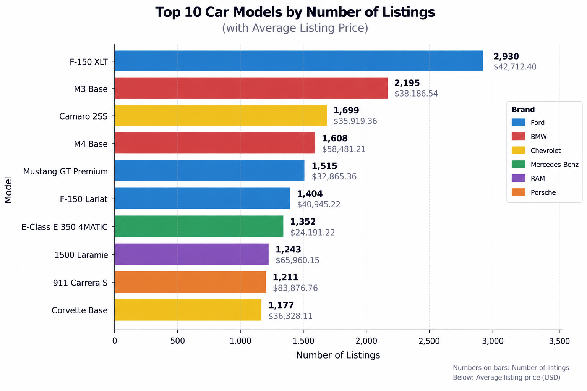
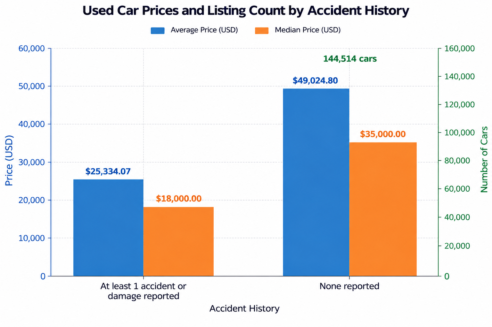
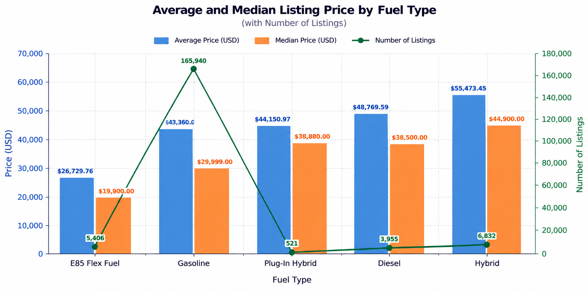

# 🚗 Car Sales Listings | SQL Buisness Analysis
## 📌 Project Overview
The objective of this project is to Analyze used-car listings using PostgreSQL to identify which brands and models have the highest listing volumes, which ones generate the greatest total listing value, how prices vary across vehicles, and wheather factors such as accident history, fuel type, mileage and model_year affect it monetry value.

## 🗃️ Dataset
|Attribute|Description|
|---|---|
|Dataset|Used Car Listings|
|Databse|PostgreSQL|
|Table|used_cars|
|Rows|188,533|
|Columns|13|
|Key Fields|ID, Brand, Model, Model_year, Mileage, Fuel_type, Engine, Transmission, EXT_col, INT_col, Clean_Title, Accident, Price|

## 🛠️ Tools Used & Skills Demonstrated
### 🧰 Tools Used
- PostgreSQL
- pgadmin4
- VScode
- Git/Github

### 💻 SQL Skills
**SQL**
- CTEs
- GROUP BY
- Aggregate functions
- ORDER BY
- HAVING
- CASE statements
- JOINs
- Subqueries
- Window functions
- String aggregation
- Date functions
- Data cleaning /transformation


## 🎯 Buisness Questions
1. Which brands, models, model_year have highest number of listings?
2. Which models have the highest and lowest prices?
3. How does average price vary by fuel type?
4. How does mileage relate to vehicle price?
5. How does accident history affect average vehicle price?

## K📊 Key Performance Indicators
### 🌐 Market KPIs
|Total Vehicles Listed|Number of Brands|Number of Models|
|---|---|---|
|188533|57|1898|

### 💰 Financial KPI's
|Toatal Listing Value|Average Vehicle Price|Median Vehicle Price|
|---|---|---|
|8.27B|43.87K|30.82K|

## 🔎 Key Findings
### 🏷️ Top Brands by Listing Volume
|Brands|Vehicles Listed|Total Listing Value|Average Price|Median Price|
|---|---|---|---|---|
|Ford|23.09K|935.34M|40.51K|32K|
|Mercedes-Benz|19.17K|982.45M|51.24K|36.5K|
|BMW|17.02K|743.43M|43.65K|31.0K|
|Porshe|10.61K|752.39M|70.89K|45.9K|
|Audi|10.88K|446.41M|41.00K|29.9K|
|Chevrolet|16.33K|683.40M|41.83K|32.0K|
|Land|9.52K|506.77M|53.20K|38.9K|

## 📈 Visual Analysis

### 🏷️ Brand & Model Analysis
- 

### ⚠️ Accident History & Price Analysis
- 

### ⛽ Fuel Type Analysis
- 

## 💡 Insights 
- Ford has highest number of listings adding upto 23088 and its model F-150 XLT has 2934 listings alone.

- Car Models released in 2021 have highest listings followed by year 2018.

- Avg price of Hybrid cars is highest followed by Diesel, while E85 Flex Fuel have lowest Average price.

- The mileage in dataset refers to the distance covered by the vehicle before being listed, Vehicles with higher mileage tend to have lower Average and Median Prices.

- There lies a massive diff of $23690.73 in cars with vs without accidents.

## ⚖️ Limitations & Caveats
- The dataset contains repeated maximum and minimum price values across multiple brands and models.

- Therefore, total listing value should not be interpreted as actual revenue.

- Listing volume represents marketplace inventory, not confirmed vehicle sales.

- Findings describe the dataset's observed listings and should not be treated as a complete representation of the entire used-car market.

## 🏁 Conclusion
This analysis provides a market-level view of 188K+ used-car listings using PostgreSQL. It show that listing volume is concentrated among a relatively small group of brands and models, while vehicle prices vary substantially across fuel types, mileage levels, model years, and accident history.

The analysis also shows that listing volume and vehicle value are not necessarily aligned. Some brands contribute a large number of listings without having the highest average prices, while higher-priced vehicle categories can generate substantial total listing value from fewer listings.

The project demonstrates how SQL can be used to move from raw marketplace data to actionable business insights by combining aggregation, filtering, statistical analysis, and comparative analysis.

## 🧾 SQL Analysis Files

All queries used for the analysis are available here:

📄 [View SQL Analysis Queries](./sql/used_cars_analysis.sql)

##  Project Strucure

## 📁 Project Structure

```
Used_car_sql_analysis_project/
│
├── 📁 charts/
│   ├── AccidentPriceVariation.png
│   ├── FuelTypeComparison.png
│   └── Top10.png
│
├── 📁 Dataset/
│   └── used_cars.csv
│
├── 📁 SQL_load/
│   ├── create_table.sql
│   └── load_table.sql
│
├── 📁 SQL_project/
│   ├── analysis.sql
│   └── data_quality.sql
│
├── 📁 .vscode/
│
├── 📄 .gitignore
└── 📄 README.md
```
## 👤 Author

### Varun
**Aspiring Data Analyst | SQL • PostgreSQL • Data Analysis**